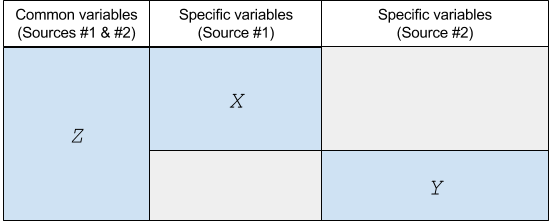

About this document
===================

<p align="justify">This is the main vignette for `micromatch` package. This package provides a set of utilities to ease the task of statistically matching independent microdata files, with a focus to official statistics. 

The main methods in `micromatch` are described in two books (see [1] and [2]), and are a result of two Eurostat projects in Data Integration and Statistical Matching (see [3] and [4]). `micromatch` heavily relies on `StatMatch`, the R package that implements the methods in those sources.</p>

<p align="justify">This document has two main parts. In the first chapter you will find an overview of the main concepts in statistical matching methodology. In the second chapter you will see how `micromatch` can be used in practice, to solve diverse matching tasks.</p>

<p align="justify">`micromatch` package also provides vignettes for specific examples with real data. These additional documents can be found in the package documentation.</p>

Fundamentals of Statistical Matching
====================================

> Statistical matching provides a methodology to explore ways for producing combined analyses or indicators for independent surveys referred to the same population of interest, from data with to distinct observations and stored in separate files, but sharing a common block of information

<p align="justify"><strong>Statistical matching</strong> (also known as data fusion, data merging or synthetic matching) is set of techniques for providing joint information on variables or indicators collected through multiple sources, usually, surveys drawn from the same population of interest. The potential benefits of this approach lie in the possibility to enhance the complementary use and analytical potential of existing data sources. ([5] A. Leulescu & M. Agafitei, 2013).</p>

<p align="justify">Statistical matching has been widely used in market research, to link consumer behavior data and media consumption data.</p>

<p align="justify">In official statistics, it can be used to link different aspects that are usually studied separately for the same target population (i.e. the inhabitants in a country or a particular geographic area). A unique questionnaire covering all aspects such as population health, income, consumption, labour market, social capital... is seldom conceived: such a questionnaire would be too long, leading to a higher response burden, and to poor quality.</p>

<p align="justify">On the contrary, a separate survey is usually conducted to study each specific aspect of the population, the drawback being that the responses will eventually lie in separate files. Statistical matching tries to overcome this limitation, by making use of shared information in order to infer some type of "new" knowledge about aspects measured by independent surveys.</p>

The starting point (the input)
------------------------------

> The basic assumption is that the number of individuals or units in both samples (i.e., the overlap) is negligible. In fact, the fundamental difference with respect to other methods such as "record linkage" is that in the latter, we have identical units and we wish to find a correspondence between them to link the files. 
In statistical matching, we "know" the units are different, but we "wish" to find similar ones.

<p align="justify">Consider two independent surveys conducted on the same population of interest, each of which produces measures regarding a specific field (e.g. living styles and consumer behavior).</p> 

<p align="justify">The surveys share a block of variables (sociodemographic variables such as the age, sex, or social status). When putting all the observations surveys together, a particular missing data pattern emerges due to the non-observed values (i.e. answers we don't have in one survey just because they correspond to the other, independent survey), see Fig 1.</p>

<div align="center"><figcaption>Fig 1. The starting point: a block of common variables (Z) and two block of specific, non-jointly-observed, variables (X and Y)</figcaption></div>

<p align="justify">The aim is to obtain integrated analyses or results relating the non-jointly-observed variables (blocks X and Y in the figure), and to achieve this we need to make use of the common information between the files (block Z) in some efficient and reliable way.</p>

The results (the output)
------------------------

<p align="justify">After matching will typically obtain one of these results:</p>

* a synthetic file containing full information on the variables and all units from both sources. This enhanced dataset can be used later to make combined statistical analyses.

* particular estimates regarding variables living in separate files. The user might wish to estimate a contingency table or correlation coefficient, or any parameter of interest regarding variables in separate files. 

The former is named the **micro** approach. The latter is the **macro** approach.

The matching process
--------------------

<p align="justify">Regardless of the matching method itself —that is, the computational method by means of which we will produce a synthetic file (in the micro case) or estimations for certain parameters of the joint distributions (in the macro case)—, the matching task involves a series of <strong>pre-processing steps</strong> that have to be tackled in practice:</p>

1. The choice of target variables (X and Y), i.e. the variables observed in distinct surveys.

2. Identification of the variables shared by the sources, and the study of the degree of coherence taking into account not only the wording of questions (which can be different, leading to non-agreeable measures), but also the marginal distributions observed in the data files. Variables that fail to show a minimum degree of coherence must be discarded. This step can be time-consuming but can also the key for a successful matching. 

3. Possibly, discarding further variables that are not predictive (i.e. are not related to) for the target variables, o are redundant with others. This can be of a relevant step, depending on the computational method. 

4. The choice of a matching framework (parametric, non-parametric, mixed) in a specific setting (micro or macro), and applying the corresponding matching/imputation/estimation algorithm. This algorithm will make use of the chosen subset of shared variables in steps 2 and 3 (namely, the _common matching variables_) to relate target variables fixed in step 1 (the _specific variables_).

5. A validation of results.

Using `micromatch`
=================

<p align="justify">In this chapter you will find how `micromatch` may be used to tackle a specific matching task with real data, and how this package relates to —and is based on— other packages.</p>

Relation to other packages
---------------------------

<p align="justify">As opposed to other packages such as `StatMatch` or `mice` that provide sophisticated functions to solve different statistical matching tasks, `micromatch` does not offer new algorithms for matching but, rather, provides a context the matching task is made easier, independently of the chosen methodology.</p>

<p align="justify">Specifically, `micromatch` does not offer new functions to solve the statistical matching problem, but a <strong>framework</strong> where the main methods implemented in other packages become related.</p>

<p align="justify">To achieve this integration, `micromatch` uses S4 classes and methods so that the user will start defining particular attributes of the data related to the statistical matching context. In particular, each step in the matching process has its implementation (or definition) in `micromatch`.</p>

A simple example
----------------

<p align="justify">To illustrate the use of `micromatch` we will be using data frames data `samp.A` and `samp.B` included in `StatMatch` package. These examples provide some artificial data simulating typical variables present in the European Union Statistics on Income and Living Conditions Survey (EU-SILC).</p>


```r
library(StatMatch)
data(samp.A) #loads data into workspace
data(samp.B) #loads data to workspace
str(samp.A)
```

```
## 'data.frame':	3009 obs. of  13 variables:
##  $ HH.P.id : chr  "10149.01" "17154.02" "5628.01" "15319.01" ...
##  $ area5   : Factor w/ 5 levels "NE","NO","C",..: 1 1 2 4 4 3 4 5 4 3 ...
##  $ urb     : Factor w/ 3 levels "1","2","3": 1 1 2 1 2 2 2 2 2 2 ...
##  $ hsize   : int  1 2 1 2 5 2 4 3 4 4 ...
##  $ hsize5  : Factor w/ 5 levels "1","2","3","4",..: 1 2 1 2 5 2 4 3 4 4 ...
##  $ age     : num  85 78 48 78 17 28 26 51 60 21 ...
##  $ c.age   : Factor w/ 5 levels "[16,34]","(34,44]",..: 5 5 3 5 1 1 1 3 4 1 ...
##  $ sex     : Factor w/ 2 levels "1","2": 2 1 1 1 1 2 2 2 2 2 ...
##  $ marital : Factor w/ 3 levels "1","2","3": 3 2 3 2 1 2 1 2 2 1 ...
##  $ edu7    : Factor w/ 7 levels "0","1","2","3",..: 4 4 4 2 2 6 6 3 2 4 ...
##  $ n.income: num  1677 13520 20000 12428 0 ...
##  $ c.neti  : Factor w/ 7 levels "(-Inf,0]","(0,10]",..: 2 3 4 3 1 1 2 3 1 1 ...
##  $ ww      : num  3592 415 2735 1240 5363 ...
```

```r
str(samp.B)
```

```
## 'data.frame':	6686 obs. of  12 variables:
##  $ HH.P.id: chr  "5.01" "5.02" "24.01" "24.02" ...
##  $ area5  : Factor w/ 5 levels "NE","NO","C",..: 5 5 3 3 1 1 2 2 2 2 ...
##  $ urb    : Factor w/ 3 levels "1","2","3": 3 3 2 2 1 1 2 2 2 2 ...
##  $ hsize  : int  2 2 2 2 2 2 3 3 3 3 ...
##  $ hsize5 : Factor w/ 5 levels "1","2","3","4",..: 2 2 2 2 2 2 3 3 3 3 ...
##  $ age    : num  45 18 76 74 47 46 53 55 21 53 ...
##  $ c.age  : Factor w/ 5 levels "[16,34]","(34,44]",..: 3 1 5 5 3 3 3 4 1 3 ...
##  $ sex    : Factor w/ 2 levels "1","2": 2 2 1 2 1 2 2 1 2 1 ...
##  $ marital: Factor w/ 3 levels "1","2","3": 3 1 2 2 1 1 2 2 1 2 ...
##  $ edu7   : Factor w/ 7 levels "0","1","2","3",..: 4 3 2 3 3 6 4 4 4 3 ...
##  $ labour5: Factor w/ 5 levels "1","2","3","4",..: 3 5 4 4 1 5 5 1 5 1 ...
##  $ ww     : num  179 179 330 330 1116 ...
```

The independent sources `samp.A` and `samp.B`, separately contain:

* a shared block of variables: 

    + `HH.P.id`: unit identifier
    + `area5` and `urb`: geographic variables
    + `hsize` and `hsize5`: family size (numeric and categorized)
    + `age` and `c.age`: age (numeric and categorized)
    + `sex`: gender
    + `marital`: marital status
    + `edu7`: education level

* one specific variable in each of the files:

    + in file `samp.A`: `n.income` and `c.neti`, net personal income (numeric and categorized, thousand of euros)
    
    + in file `samp.B`: `labour5`, the person's self-defined economic status.

* a weight variable,    `ww`, with the same name in both files

For more information on these data files please refer to `StatMatch` package documentation.

What follows is an illustration of how the matching task can be tackled with `micromatch`, in each of the mentioned steps:

#### Step 1: 

The specific (target) variables are the income and the labour status, and it is advisable to store their name. For this example we will use the categorical version of variable income, `c.neti`.


```r
varesp_A <- "c.neti" # specific variable in file samp.A
varesp_B <- "labour5" # specific variable in file samp.B
```

#### Step 2: 

<p align="justify">The shared variables are the remaining variables (excluding the identifier, `HH.P.id`, and the weight variable, `ww`). For this example we will use the categorical versions of the variables and one geographic area: `urb`.</p>


```r
varshared <- c("urb", "c.age", "hsize5", "sex", "marital", "edu7") # shared variables
```

There is also a weight variable with the same name in both files. (Note that naming the same variables equally is in general a good practice).


```r
weights <- "ww" # weight variable (same name in samp.A and samp.B)
```

Now that we have all the information, the purpose of matching can be made concrete: 

        * We want to relate variables `c.neti` and `labour5` by applying some matching
        method that will use a subset of `varshared` variables, and producing a synthetic, 
        complete file. Specifically, we will fill `samp.A` -which therefore will act as the 
        receptor file-, with variable `labour5` from `samp.B` -which will be the donor file
        -.

**Important Note**
In general, the file with less observations is used as receptor. The reason is that, otherwise, observations would have to be used many times in order to "fill"" the bigger file.

In `micromatch`, we have a way to express this by means of `receptor` and `donor` constructor functions:


```r
library(micromatch)
# create the receptor object
rec <- receptor(data = samp.A, matchvars = varshared, specvars = varesp_A, weights=weights) # create the donor object
don <- donor(data = samp.B, matchvars = varshared, specvars = varesp_B, weights=weights)
```

We can check the parameter (slot) values by using `str`:


```r
str(rec)
```

```
## Formal class 'filetomatch' [package "micromatch"] with 6 slots
##   ..@ role      : chr "receptor"
##   ..@ data      :'data.frame':	3009 obs. of  13 variables:
##   .. ..$ HH.P.id : chr [1:3009] "10149.01" "17154.02" "5628.01" "15319.01" ...
##   .. ..$ area5   : Factor w/ 5 levels "NE","NO","C",..: 1 1 2 4 4 3 4 5 4 3 ...
##   .. ..$ urb     : Factor w/ 3 levels "1","2","3": 1 1 2 1 2 2 2 2 2 2 ...
##   .. ..$ hsize   : int [1:3009] 1 2 1 2 5 2 4 3 4 4 ...
##   .. ..$ hsize5  : Factor w/ 5 levels "1","2","3","4",..: 1 2 1 2 5 2 4 3 4 4 ...
##   .. ..$ age     : num [1:3009] 85 78 48 78 17 28 26 51 60 21 ...
##   .. ..$ c.age   : Factor w/ 5 levels "[16,34]","(34,44]",..: 5 5 3 5 1 1 1 3 4 1 ...
##   .. ..$ sex     : Factor w/ 2 levels "1","2": 2 1 1 1 1 2 2 2 2 2 ...
##   .. ..$ marital : Factor w/ 3 levels "1","2","3": 3 2 3 2 1 2 1 2 2 1 ...
##   .. ..$ edu7    : Factor w/ 7 levels "0","1","2","3",..: 4 4 4 2 2 6 6 3 2 4 ...
##   .. ..$ n.income: num [1:3009] 1677 13520 20000 12428 0 ...
##   .. ..$ c.neti  : Factor w/ 7 levels "(-Inf,0]","(0,10]",..: 2 3 4 3 1 1 2 3 1 1 ...
##   .. ..$ ww      : num [1:3009] 3592 415 2735 1240 5363 ...
##   ..@ matchvars : chr [1:6] "urb" "c.age" "hsize5" "sex" ...
##   ..@ specvars  : chr "c.neti"
##   ..@ stratavars: NULL
##   ..@ weights   : chr "ww"
```

```r
str(don)
```

```
## Formal class 'filetomatch' [package "micromatch"] with 6 slots
##   ..@ role      : chr "donor"
##   ..@ data      :'data.frame':	6686 obs. of  12 variables:
##   .. ..$ HH.P.id: chr [1:6686] "5.01" "5.02" "24.01" "24.02" ...
##   .. ..$ area5  : Factor w/ 5 levels "NE","NO","C",..: 5 5 3 3 1 1 2 2 2 2 ...
##   .. ..$ urb    : Factor w/ 3 levels "1","2","3": 3 3 2 2 1 1 2 2 2 2 ...
##   .. ..$ hsize  : int [1:6686] 2 2 2 2 2 2 3 3 3 3 ...
##   .. ..$ hsize5 : Factor w/ 5 levels "1","2","3","4",..: 2 2 2 2 2 2 3 3 3 3 ...
##   .. ..$ age    : num [1:6686] 45 18 76 74 47 46 53 55 21 53 ...
##   .. ..$ c.age  : Factor w/ 5 levels "[16,34]","(34,44]",..: 3 1 5 5 3 3 3 4 1 3 ...
##   .. ..$ sex    : Factor w/ 2 levels "1","2": 2 2 1 2 1 2 2 1 2 1 ...
##   .. ..$ marital: Factor w/ 3 levels "1","2","3": 3 1 2 2 1 1 2 2 1 2 ...
##   .. ..$ edu7   : Factor w/ 7 levels "0","1","2","3",..: 4 3 2 3 3 6 4 4 4 3 ...
##   .. ..$ labour5: Factor w/ 5 levels "1","2","3","4",..: 3 5 4 4 1 5 5 1 5 1 ...
##   .. ..$ ww     : num [1:6686] 179 179 330 330 1116 ...
##   ..@ matchvars : chr [1:6] "urb" "c.age" "hsize5" "sex" ...
##   ..@ specvars  : chr "labour5"
##   ..@ stratavars: NULL
##   ..@ weights   : chr "ww"
```

#### Step 3-1 (assess coherence) 

We now inspect the concordance of marginal distributions of the shared variables. In `micromatch` three kind of tools are implemented: frequency tables, plots and empirical measures (as computed by `comp.prop` function in `StatMatch`).

Because we have previously stored information about each type of variable we only need to choose the options, i.e. 

* `type`: equal to `table`, `plot` or `measures`; 
* `cell_values`: `abs` (absolute numbers) `rel` (relative, i.e. percents) for type `table` or `plot
* `weights`: `TRUE` or `FALSE`;
* `strata`: `TRUE` or `FALSE`

The third option may be used when a strata variable is introduced, i.e. in case we want to perform matching separately for distinct groups in the population (male and female, etc).
 

```r
# tables
compare_matchvars(x = rec, y = don, type = "table", cell_values = 'abs', weights = TRUE)
```

```
## $`Table for data:  slot(x, "data")`
## x_vector
##       1       2       3 
## 2192673 2060570  841709 
## 
## $`Table for data:  slot(y, "data")`
## x_vector
##       1       2       3 
## 2264015 2080967  812600 
## 
## $`Table for data:  slot(x, "data")`
## x_vector
##  [16,34]  (34,44]  (44,54]  (54,64] (64,104] 
##  1221890   987127   936503   727844  1221589 
## 
## $`Table for data:  slot(y, "data")`
## x_vector
##  [16,34]  (34,44]  (44,54]  (54,64] (64,104] 
##  1210076  1039953   890703   759901  1256950 
## 
## $`Table for data:  slot(x, "data")`
## x_vector
##       1       2       3       4     >=5 
##  889539 2093652 1194842  726198  190722 
## 
## $`Table for data:  slot(y, "data")`
## x_vector
##       1       2       3       4     >=5 
##  854453 2213844 1182355  740957  165973 
## 
## $`Table for data:  slot(x, "data")`
## x_vector
##       1       2 
## 2454480 2640472 
## 
## $`Table for data:  slot(y, "data")`
## x_vector
##       1       2 
## 2512704 2644878 
## 
## $`Table for data:  slot(x, "data")`
## x_vector
##       1       2       3 
## 1525656 2838298  730998 
## 
## $`Table for data:  slot(y, "data")`
## x_vector
##       1       2       3 
## 1511497 2858124  787961 
## 
## $`Table for data:  slot(x, "data")`
## x_vector
##       0       1       2       3       4       5       6 
##  135596  943911 1586638 1709141  143383  558240   18042 
## 
## $`Table for data:  slot(y, "data")`
## x_vector
##       0       1       2       3       4       5       6 
##  149580  997272 1604171 1687398  141107  564486   13568
```

```
## $urb
## NULL
## 
## $c.age
## NULL
## 
## $hsize5
## NULL
## 
## $sex
## NULL
## 
## $marital
## NULL
## 
## $edu7
## NULL
```

```r
# plots
compare_matchvars(x = rec, y = don, type = "plot", cell_values = 'rel', weights = TRUE)
```

```
## ymax not defined: adjusting position using y instead
```

 

```
## ymax not defined: adjusting position using y instead
```

 

```
## ymax not defined: adjusting position using y instead
```

 

```
## ymax not defined: adjusting position using y instead
```

 

```
## ymax not defined: adjusting position using y instead
```

 

```
## ymax not defined: adjusting position using y instead
```

 

```
## $urb
## NULL
## 
## $c.age
## NULL
## 
## $hsize5
## NULL
## 
## $sex
## NULL
## 
## $marital
## NULL
## 
## $edu7
## NULL
```

```r
# disimilarity measures
compare_matchvars(x = rec, y = don, type = "measures", weights = TRUE)
```

```
## [1] "Measures for variable: urb"
## [1] "Measures for variable: c.age"
## [1] "Measures for variable: hsize5"
## [1] "Measures for variable: sex"
## [1] "Measures for variable: marital"
## [1] "Measures for variable: edu7"
```

```
##              urb   c.age  hsize5      sex  marital    edu7
## tvd     0.008606 0.01632 0.01944 0.005439 0.009302 0.01048
## overlap 0.991394 0.98368 0.98056 0.994561 0.990698 0.98952
## Bhatt   0.999933 0.99983 0.99973 0.999985 0.999908 0.99987
## Hell    0.008181 0.01287 0.01654 0.003848 0.009599 0.01147
```

Overall, for the these marginal distributions, both tables and graphics indicate that the shared variables are highly concordant. 

In particular, Hellinger's distance (Hell) is below 0.05 in all cases (an usual rule of thumb in statistical matching).

#### Step 3-2 (assess predictive value)

Now we will assess the predictive value of the common variables with respect to the specific ones, in order to discard unnecessary information.

In `micromatch`, for categorical variables we can use `predictvalue` which relies on `StatMatch` function `pw.assoc`. This function returns four well-known statistical association measures for all the combinations of variables, based on Chi-Square and others:

* Cramer's `V`
* Goodman-Kruskal `lambda`
* Goodman-Kruskal `tau`
* Theil's uncertainty coefficient `U`

For more information on these measures please refer to `StatMatch` or Agresti's book ([6]).


```r
predictvalue(x = rec) # predictive value in file samp.A
```

```
## Warning: Chi-squared approximation may be incorrect
```

```
## [[1]]
## [[1]]$V
##     c.neti.urb   c.neti.c.age  c.neti.hsize5     c.neti.sex c.neti.marital 
##        0.06198        0.22634        0.12084        0.35188        0.18533 
##    c.neti.edu7 
##        0.16891 
## 
## [[1]]$lambda
##     c.neti.urb   c.neti.c.age  c.neti.hsize5     c.neti.sex c.neti.marital 
##        0.00000        0.08683        0.02994        0.04448        0.03636 
##    c.neti.edu7 
##        0.04534 
## 
## [[1]]$tau
##     c.neti.urb   c.neti.c.age  c.neti.hsize5     c.neti.sex c.neti.marital 
##       0.001131       0.040176       0.011965       0.022123       0.013850 
##    c.neti.edu7 
##       0.027589 
## 
## [[1]]$U
##     c.neti.urb   c.neti.c.age  c.neti.hsize5     c.neti.sex c.neti.marital 
##       0.002091       0.053322       0.017561       0.034456       0.019466 
##    c.neti.edu7 
##       0.041839
```

```r
predictvalue(x = don) # predictive value in file samp.B
```

```
## Warning: Chi-squared approximation may be incorrect
```

```
## [[1]]
## [[1]]$V
##     labour5.urb   labour5.c.age  labour5.hsize5     labour5.sex 
##         0.03222         0.39412         0.11126         0.32181 
## labour5.marital    labour5.edu7 
##         0.23630         0.23968 
## 
## [[1]]$lambda
##     labour5.urb   labour5.c.age  labour5.hsize5     labour5.sex 
##         0.00000         0.29530         0.02598         0.08789 
## labour5.marital    labour5.edu7 
##         0.04587         0.15386 
## 
## [[1]]$tau
##     labour5.urb   labour5.c.age  labour5.hsize5     labour5.sex 
##       0.0004783       0.1988406       0.0142621       0.0329951 
## labour5.marital    labour5.edu7 
##       0.0299137       0.0776071 
## 
## [[1]]$U
##     labour5.urb   labour5.c.age  labour5.hsize5     labour5.sex 
##       0.0007065       0.2485754       0.0166305       0.0371158 
## labour5.marital    labour5.edu7 
##       0.0420075       0.0803915
```

A simple, temptative choice would be to keep varibles `c.age`, `sex` and `edu7`. Also, it can be a good idea to introduce `sex` as a group or strata variable. 

**Note**

This variable selection is also backed by the reduction-of-uncertainty analyses in the `StatMatch` package vignette. This functionality has not been implemented in `micromatch`.

We now proceed to update the information in the `receptor` and `donor` objects by using `update` function in `micromatch`. Note that the new objects must be stored in the session:


```r
rec1 <- update(x = rec, matchvars = c("c.age", "edu7"), stratavars = "sex") # update variables for file A (receptor)
don1 <- update(x = don, matchvars = c("c.age", "edu7"), stratavars = "sex") # update variables for file B (donor)
```

#### Step 4:

In this example distance hot-deck imputation will be used to fill the non-observed values (variable `labour5` from `samp.B`) in file `samp.A`. 

In `micromatch` we can use the `match.hotdek` function, which in turn calls to `NND.hotdeck` function in `StatMatch`. This function finds the closest donor record in `don` for each file in `rec`, based on the chosen matching variables, in this case, `c.age` and `edu7` (variables defined in `matchvars`). The search is made within levels of `sex`, that is, separately for male and female.

After receptor, donor pairs are formed the algorithm imputes the value observed in the donor register to the receptor register. In this way, the receptor file is 'completed'. The function `match.hotdeck` performs the two steps as a result of only one command:


```r
result <- match.hotdeck(x = rec, y = don)
```

```
## Warning: The  Manhattan  distance is being used
## All the categorical matching variables in rec and don 
##  data.frames, if present are recoded into dummies
```

Now we can access the data and see the imputed values (last column, `labour5`). Note that the new data frame is stored in the session with the name `A.imputed`:


```r
samp.A.imp <- slot(result, "data")
head(samp.A.imp)
```

```
##        HH.P.id area5 urb hsize hsize5 age    c.age sex marital edu7
## 21384 10149.01    NE   1     1      1  85 (64,104]   2       3    3
## 35973 17154.02    NE   1     2      2  78 (64,104]   1       2    3
## 11774  5628.01    NO   2     1      1  48  (44,54]   1       3    3
## 32127 15319.01     S   1     2      2  78 (64,104]   1       2    1
## 6301   2973.05     S   2     5    >=5  17  [16,34]   1       1    1
## 12990  6206.02     C   2     2      2  28  [16,34]   2       2    5
##       n.income   c.neti     ww labour5
## 21384     1677   (0,10] 3591.9       4
## 35973    13520  (10,15]  415.2       4
## 11774    20000  (15,20] 2735.4       1
## 32127    12428  (10,15] 1239.5       4
## 6301         0 (-Inf,0] 5362.8       1
## 12990        0 (-Inf,0] 2077.7       1
```

TODO. Details about the receptor and donor pairs can be obtained by means of the `details` function.

#### Step 5:

The first, reasonable validation is to check the concordance of imputed vs observed marginal distributions.

In our example the first validation would consist in comparing the distribution for variable `labour5` in the original file `samp.B` versus the imputed variable in `samp.A.imp` file. 

For this purpose, we can use `tabulate2cat`, `plot2cat` and `similarity2cat` functions in `micromatch`, which essentially provide the same functionality as `compare_matchvars` (seen in step 3-1). 

Note that, instead of handling special objets, here we use the data frames directly: in this case, `samp.B` and `samp.A.imp`. The variable to compare is `labour5` in both files, so, for convenience, we can store it as a character. The same happens with `ww`, the weights variable:


```r
var <- "labour5"
weights <- "ww"
# raw tables
tabulate2cat(data_A = samp.B, data_B = samp.A.imp, var_A = var, var_B = var, weights_A = weights, weights_B = weights, cell_values = "rel")
```

```
## $`Table for data:  samp.B`
## x_vector
##       1       2       3       4       5 
## 0.35125 0.09243 0.05730 0.21069 0.28833 
## 
## $`Table for data:  samp.A.imp`
## x_vector
##       1       2       3       4       5 
## 0.34404 0.08454 0.07113 0.20919 0.29111
```

```r
# plots with percents
plot2cat(data_A = samp.B, data_B = samp.A.imp, var_A = var, var_B = var, weights_A = weights, weights_B = weights, cell_values = "rel") # blue bar corresponds to imputed values
```

```
## ymax not defined: adjusting position using y instead
```

 

```r
# empirical measures
similarity2cat(data_A = samp.B, data_B = samp.A.imp, var_A = var, var_B = var, weights_A = weights, weights_B = weights) 
```

```
## [1] "Measures for variable: labour5"
```

```
##     tvd overlap   Bhatt    Hell 
## 0.01661 0.98339 0.99952 0.02201
```

The results are quite acceptable, but we should continue comparing distributions conditioned on other variables.

<p align="justify">For example, a natural comparison would be to check distributions conditioned on `sex`, which was in fact used as strata variable. This can be done in with the same functions, by iterating over strata values, as follows:</p


```r
levels(samp.B$sex) # codes for gender: 1-male, 2-female, check ?samp.A
```

```
## [1] "1" "2"
```

```r
# Gender equal to "1" = male
similarity2cat(data_A = subset(samp.B, sex == "1"), data_B = subset(samp.A.imp, sex == "1"), var_A = var, var_B = var, weights_A = weights, weights_B = weights)
```

```
## [1] "Measures for variable: labour5"
```

```
##     tvd overlap   Bhatt    Hell 
## 0.02463 0.97537 0.99955 0.02114
```

```r
# Gender equal to "2" = female
similarity2cat(data_A = subset(samp.B, sex == "2"), data_B = subset(samp.A.imp, sex == "2"), var_A = var, var_B = var, weights_A = weights, weights_B = weights)
```

```
## [1] "Measures for variable: labour5"
```

```
##     tvd overlap   Bhatt    Hell 
## 0.03154 0.96846 0.99869 0.03620
```

Results seem to be 'good' by strata too.

<p align="justify">However, in statistical matching the validation should imply a lot more effort. The reason is that most matching algorithms assume what is known as the _conditional independence assumption_, which amounts to taking for granted that common variables (Z) explain (or _mediate_ between), all the (non-observed) relation between specific variables (X and Y).</p>

<p align="justify">Such an assumption is particularly strong and seldom holds in practice. What is worse, in default of complete observations —possibly in the form of a third independent file `C`, that may contain observatins for all variables, maybe from a previous wave of the same surveys, and not too distant in time so that it refers to almost the same population of interest—, we will lack of the necessary data in order to check how far we are from the ideal situation.</p>

One recommended approach is to perform an uncertainty analysis.

**Note** 

Additional functions will be soon implemented to accept iteration over strata variable groups.

Additional features
-------------------

References
==========

[1] D'Orazio, M., Di Zio, M., & Scanu, M. (2006). *Statistical matching: Theory and practice*. John Wiley & Sons.

[2] Rässler, S. (2002). *Statistical matching*. Springer.

[3] *Data Integration* ESSnet project. (http://www.cros-portal.eu/content/data-integration-finished)

[4] *ISAD* ESSnet project (http://www.cros-portal.eu/content/isad-finished)

[5] Leulescu A. & Agafitei, M. *Statistical matching: a model based approach for data integration*, Eurostat methodologies and working papers, 2013. (http://epp.eurostat.ec.europa.eu/cache/ITY_OFFPUB/KS-RA-13-020/EN/KS-RA-13-020-EN.PDF)
