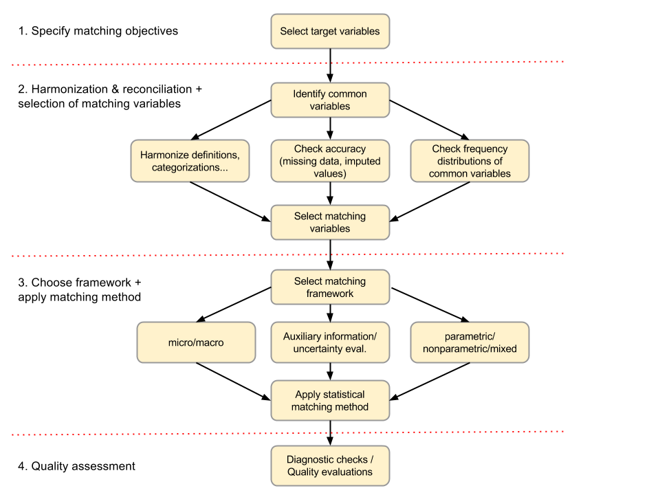

<!--
%\VignetteEngine{knitr::rmarkdown}
%\VignetteIndexEntry{micromatch package: Making statistical matching easier}
-->

`micromatch` provides a set of utilities to ease the task of statistically matching microdata files from official statistics.

The main methods that `micromatch` relies on are described in two books: [1] and [2], and are also a result of two Eurostat projects in data integration and statistical matching (see references [3] and [4]).

What is statistical matching?
=============================
Statistical matching (also known as data fusion, data merging or synthetic matching) is set of techniques for providing joint information on variables or indicators collected through multiple sources, usually, surveys drawn from the same population. The potential benefits of this approach lie in the possibility to enhance the complementary use and analytical potential of existing data sources. (A. Leulescu & M. Agafitei, 2013).

Statistical matching has been widely used in market research, to link consumer behavior data and media consumption data to design better advertising campaigns.

In official statistics, the main interest lies in the possibility to link different aspects that are usually studied separately for the same target population (i.e. the inhabitants in a country or a particular geographic area). The reason is that a long questionnaire covering all aspects such as population health, income, consumption, labour market, social capital... is seldom conceived; such a questionnaire would be too long, leading to a higher response burden, and to poor quality. Normally, a separate survey is conducted to study each specific aspect, the drawback being that the responses lie in separate files.

Statistical matching provides a methodology to explore ways for producing combined analyses or indicators from independent surveys. 

The starting point
------------------

Consider two independent survey samples from the same population of interest, each of which produces measures regarding a specific field (for example, living styles and consumer behavior). The surveys share a block of variables (sociodemographic variables such as the age, sex, or social status). When putting all the observations surveys together, a particular _missing data_ pattern due to the non-observed values emerges (i.e., answers we don't have in one survey just because they correspond to the other, independent survey), see Fig 1.


**Fig 1. The starting point: a block of common variables (Z) and two block of specific, non-jointly-observed, variables (X and Y)**

The aim is to obtain integrated analyses or results relating the non-jointly-observed variables (blocks _X_ and _Y_ in the figure), and to achieve this we need to make use of the common information between the files (block _Z_) in some efficient and reliable way.


        * The basic assumption is that the number of individuals or units in both
        samples (i.e., the overlap) is negligible. 
        
        The fundamental difference with respect to other methods such as "record
        linkage" is that in the latter, we have identical units and we wish to 
        find a correspondence between them to link the files. 
        
        In statistical matching, we "know" the units are different, but we "wish" 
        to find similar ones.

When should we use `micromatch`?
-------------------------------

We should use `micromatch` when having two separate files, A and B, with:

1. _distinct units_ referred to the _same population of interest_, 
2. a common block of variables (which we call _common variables_), and 
3. two sets of distinct variables in each file (which we call _specific variables_),

and we wish to relate the specific variables in order to produce combined statistical analyses. 

What kind of result should we expect?
-------------------------------------

Depeding on the selected approach, we will obtain one of these results:

* a synthetic file containing full information on the variables and all units from both sources. This _enhanced_ dataset can be used later to make combined statistical analyses.

* particular estimates regarding variables living in separate files. The user might wish to estimate a contingency table or correlation coefficient, or any parameter of interest regarding variables in separate files. 

The former is named the _micro_ approach. The latter is the _macro_ approach.

What is the solution implemented in `micromatch`?
-------------------------------------------------

As opposed to other packages such as `StatMatch` or `mice` that provide sophisticated functions to solve different statistical matching tasks, `micromatch` does not offer (genuinely) new functionality but rather a _context_ to make statistical matching easier, independently of which the chosen methodology is. That is: `micromatch` does not offer new functions to solve the statistical matching problem, but, on the contrary, it offers a _framework_ where the main methods implemented across other packages are integrated into a common context.

To achieve this _unification_, `micromatch` uses S4 classes and methods so that the user will start defining particular attributes of the data related to the statistical matching context. In particular, every step needed to tackle a particular problem of statistical matching has its implementation (or definition) in `micromatch`. 

### The matching process

`micromatch` is organized around four families of functions related to the main steps of the statistical matching process, see Fig 2.



**Fig 2: The statistical matching process.**

In a micro setting, we may want to fill one of the files. In this case, we say that:

        * The file to be completed is the _recipient_ file, whereas
        * The file that donates variables the other file is the _donor_. 

We may also want to fill variables in both files: when no distinction is made between receptor and donor files we will assume the files have a `symmetric` role.

**`receptor` and `donor` files in `micromatch`**

In a typical session with `micromatch`, we will start by defining a `receptor` and a `donor` file, or two `symmetric` files. These special objects will contain not only the data frames with observations and variables (i.e. the microdata files themselves), but also some key information related to the statistical matching process. 

In the following we will illustrate the use of `micromatch` by means of real examples.

The first example: matching `ecv` and `pra`
===========================================

`micromatch` includes data from two separate surveys conducted by Eustat (The Basque Statistical Office) during the 4th quarter of 2009: 

1. the Labour Force Survey (Encuesta de Población en Relación con la Actividad, `pra`), and 
2. the Living Conditions Survey (Encuesta de Condiciones de Vida, `ecv`)

(Please refer to the package documentation for a full description of these datasets).

In the following steps, we will see how a synthetic file can be obtained starting from these two separate data frames, `ecv` and `pra`. Each step of the matching task (Fig 2) is covered by a set of functions in `micromatch`.

### Step 1: Specify the purpose of matching

First of the main elements of the matching task need to be specified:

* The list of _shared variables_ (i.e. the variables common to both files. Typically: age, sex, education level...)
* A list of _specific variables_ for the first file, A
* A list of _specific variables_ for the second file, B
* Optionally, some _stratum variables_, i.e. variables defining separate sub-groups on the population (typically sex or age)
* Possibly, some _weight variables_, i.e. variables used for estimating values for all the population)

`ecv` gives a bunch of living condition measures such as frequency of social relations, economic status, health problems, and so on. `pra` focuses on the labour market and produces a segmentation of the population in 5 categories. In this example the aim is to obtain contingency tables that cross each of the `ecv` items with the labour market segmentation provieded by `pra`.

Because `pra` has more than twice as observations than `ecv`, `pra` will act as donor and `ecv` as recipient. This means that the unique specific variable in `pra` (i.e. the labour market segmentation) will be donated (i.e. imputed) into the `ecv` file. This will produce a synthetic file with one additional variable (column) in the initial `ecv` file.

The specific variable in `pra` is the labour market segmentation (variable `labour`) with the following categories:

```{r, warning=FALSE, message=FALSE}
library(micromatchdev)
data(pra)
levels(pra$labour)
```

Since `ecv` is a quite long questionnaire measuring many different aspects of quality and style of life, a sample of interesting items was selected for inclusion in this package:

```{r}
data(ecv)
str(ecv[,13:25])
```

### Step 2: Select matching variables

The shared variables between `ecv` and `pra` are shown in Table 1:

Variable   | Short Name | Type
------------- | ----- | -------------
Territory  | territory | 3 categories
Age  | age | 6 categories
Sex  | sex | 2 categories
Agesex  | agesex | 12 categories (combination of age and sex)
Family size  | famsize | 3 categories
Student?  | student | TRUE, FALSE
Seeking job?  | seekjob | TRUE, FALSE
Employed?  | employed | TRUE, FALSE
Unemployed?  | unemployed | TRUE, FALSE
Inactive?  | inactive | TRUE, FALSE
Hours at work  | workhours | 4 categories
Dedication to housework  | housework | 2 categories

**Table 1: Shared variables between `ecv` and `pra`**

        * Important Note: The data frames have been pre-processed in order to provide 
        the same names for the common variables, and the same category levels for the
        categorical values. These preprocessing task will have to be tackled prior to 
        using `micromatch`.

The shared variables have been unified:

```{r}
# In the first data frame: pra
str(pra[,1:12])
# In the second data frame: ecv
str(ecv[,1:12])
```

Each data frame has its weight variable, named `weights`.

For convenience, we will specify character vectors for each type of variable, as follows:

```{r defineVariables}
# Shared variables
varshared <- c("territory", "sex", "age", "agesex",
            "famsize", "student", "seekjob", "employed",
            "unemployed", "inactive", "workhours", "housework")
# Specific variables in the 1st file
varesp_A <- "labour"
# Specific variables in the 2nd file
varesp_B <- c("healthproblems", "languages", "holidaydest","sparetime",
              "indsocial", "famsocial", "equipment", "housemode",
              "ownvehicles", "ambientalcond", "econstatus", "income","moneyend")
# Weight variables (named the same way for both files)
weights <- "weights"
```

Now we proceed to define the recipient and donor files with all the previous variables:

```{r createObjects}
# Create recipient and donor files
# Donor: pra
don <- donor(data = pra, matchvars = varshared, specvars = varesp_A, weights = weights)
# Receptor: ecv
rec <- receptor(data = ecv, matchvars = varshared, specvars = varesp_B, weights = weights)
```

Now we will manipulate these objets in order to we reach a final definition for the matching task. More specifically: 

* we will select an optimal subset of `varshared`, which will act as the common variables (thus we will update the character vector for `mathcvars`), and 

* we will introduce stratum (i.e. group) variables: `stratavars`.

The common variables selected for matching must meet two conditions:

1. **Coherence**: The selected variables must show the same information across the files. The coherence refers both comparable definitions (i.e. wording of items in questionnaires) and to comparable empirical (observed) distributions.

2. **Predictive value**: The selected variables must be highly related to the specific variables in each of the files.

If these two conditions are met, then statistical matching will produce results which are (at least) coherent with the original information sources. 

(Please refer to the chapter on Validation to see what other conditions must be met in order to produce high quality results from a broader point of view.)

#### Step 2-1: Compare empirical distributions

First we need to discard variables whose empirical distributions are not comparable between the files. (Note that lack of equivalence with respect to the definition of concepts i.e., wording of items in the questionnaires, is also an important criterion in this step). 

We can use the `tabulate2cat` function to tabulate a single categorical variable in both files. Using `weights` is optional, and we can choose absolute or relative cell values with the argument `cell_values`:

```{r tabulateExample}
# Tabulate "territory", using weights and with absolute cell values
tabulate2cat(data_A = ecv, data_B = pra, var_A = "territory", var_B = "territory", 
             weights_A = "weights", weights_B = "weights", cell_values = "abs")
# Proportions (i.e. cell values relative to totals)
tabulate2cat(data_A = ecv, data_B = pra, var_A = "territory", var_B = "territory", 
             weights_A = "weights", weights_B = "weights", cell_values = "rel")
```

`plot2cat` function produces a barplot for a single categorical variable. As before, `weights` is optional, and we can choose absolute or relative cell values with the argument `cell_values`:

```{r plotExample}
# Plot "territory", using weights and with relative cell values (i.e. proportions)
plot2cat(data_A = ecv, data_B = pra, var_A = "territory", var_B = "territory", 
             weights_A = "weights", weights_B = "weights", cell_values = "rel")
```

Finally `similarity2cat` produces disimilarity/similarity measures for empirical distributions based on `StatMatch` package. Again, `weights` is optional:

```{r measuresExample}
# Plot "territory", using weights and with relative cell values (i.e. proportions)
similarity2cat(data_A = ecv, data_B = pra, var_A = "territory", var_B = "territory", 
             weights_A = "weights", weights_B = "weights")
```

Doing this on a variable-by-variable basis can be time-consuming; for this reason, specific methods have been included in `micromatch` that handle all variables defined as `matchvars` (i.e. common variables betwen the files) at once. Here is an illustration:

**All common variables at once**

* Tables.

```{r compareMatchvarsTables, eval=TRUE}
# Tables: proportions and weights
compare_matchvars(x = rec, y = don, cell_values = "rel", weights = TRUE)
```

* Plots. 

```{r compareMatchvarsPlots, eval=TRUE}
# Plots: proportions and weights
compare_matchvars(x = rec, y = don, type = "plot", cell_values = "rel", 
                  weights = TRUE)
```

* Disimilarity measures.

```{r compareMatchvarsMeasures, eval=TRUE}
# Measures: weights
compare_matchvars(x = rec, y = don, type = "measures", weights = TRUE)
```

Globally, we suspect there could be some type of incoherence in variables `famsize` (category 1 person), `unemployed` and `housework`. In any case, coherence between variables should be investigated further.

In the `ecv`-`pra` example, age and sex groups are determinant both for the labour market segmentation and for living conditions. The combined variable, `agesex`, has been created to include as a group/strata variable. 

We now remove variable `age`, `sex` and `agesex` from the common variables and include it as `stratavars` variable. `micromatch` has specific functions for easy removal (`remove`) and inclusion (`include`) of variables:

```{r}
rec1 <- remove(x = rec, vars = c("age", "sex", "agesex")) 
#removes variables and creates new object
rec2 <- include(x = rec1, vars = "agesex", as = "stratavars") 
#includes 'agesex' as strata
##
don1 <- remove(x = don, vars = c("age", "sex", "agesex"))
don2 <- include(don1, vars = "agesex", as = "stratavars")
```

Now we will repeat the analyses with objects `rec2` and `don2`, which include `agesex` as stratum variables. By setting option `strata` to `TRUE` in `compare_matchvars` method we get the same answers as before, by each stratum value (12 groups of age and sex, in this case):

**Results by `agesex` groups**

* Tables

```{r compareMatchStrataTables, eval=FALSE}
# Tables: proportions and weights
compare_matchvars(x = rec2, y = don2, type = "table", weights = TRUE, 
                  cell_values = "rel", strata = TRUE)
```

(Not printed)

* Plots

```{r compareMatchStrataPlots, eval= FALSE}
# Plots: proportions and weights
compare_matchvars(x = rec2, y = don2, type = "plot", weights = TRUE, strata = TRUE, 
                  cell_values = "rel")
```

(Not printed)

* Measures

```{r compareMatchStrataMeasures, eval= TRUE}
# Measures: weights
#compare_matchvars(x = rec2, y = don2, type = "measures", weights = TRUE, strata = TRUE)
#da error, porque hay casos con 0 casos en el estrato +65
compare_matchvars(x = remove(rec2, vars=c("unemployed", "employed", "inactive", "seekjob")), 
                  y = remove(don2, vars=c("unemployed", "employed", "inactive", "seekjob")),
                  type = "measures", weights = TRUE, strata = TRUE)
```

**First selection**

A first, tentative selection of variables by `agesex` values is done in table 2:

Stratum   | Selected variables
------------- | ------------------
Male.15-24  | student, seekjob
Female.15-24  | student, seekjob
Male.25-34  | seekjob, housework  
Female.25-34  | unemployed, housework
Male.35-44  | unemployed, famsize
Female.35-44  | unemployed, occupied
Male.45-54  | unemployed, seekjob
Female.45-54  | unemployed, seekjob
Male.55-64  | inactive, seekjob
Female.55-64  | inactive
Male.65+  | famsize
Female.65+  | famsize

*Table 2. A tentative selection of shared variables based on coherence study*

#### Step 2-2: Assess predictive value

For the pre-selected variables, we will assess the predictive value with respect to the `specvars` in each of the files.

We can use `predictvalue` method to assess the predictive value of `matchvars` with respect to `specvars`:

* In `pra` file, the (unique) specific variable is `labour`:

```{r,eval=TRUE}
predictvalue(x = remove(don, "workhours")) 
```

        * Note. `workhours` is excluded since the original function in `StatMatch`, 
        `pw.assoc`, returns an error. This is because this variable only applies to 
        occupied people:
        
```{r}
table(pra$labour, pra$workhours)
```

* In `ecv` file, we have a set of `specvars`:

```{r, eval=TRUE}
predictvalue(x = remove(rec, "workhours"))
```

Now we should inspect what happens within levels of `agesex`, i.e. repeat the previous analysis by strata.

For the pre-selected variables (see Table 2), the `select` and `predictvalue` methods can be easily combined to obtain results for `agesex` groups:

**Example: strata Male.15-24**

We inspect the predictive value of preselected variables: `student`, `seekjob` within this group.

In `pra`:

```{r}
levels(ecv$agesex)
don2.M1524 <- select_strata(x = don2, value = "Male.(15,24]")
table(slot(don2.M1524, "data")[,"agesex"]) #ok
varshared[-c(6,7)] #variables to keep
#
predictvalue(x = remove(don2.M1524 , varshared[-c(6,7)]))
```

In this case the predictive value is high so we decide to keep both: `student` and `seekjob`.
TODO: PRINT TABLES.

Proceeding this way, we finally keep all variables in Table 2 and proceed to perform hot-deck imputation.

### Step 3: Nearest neighbour hot-deck imputation

Take first 10 rows and concatenate

```{r}
rec2.prueba <- select_observations(x = rec2, obs = 1:5)
don2.prueba <- select_observations(x = don2, obs = 1:5)
concat.prueba <- concatenate(x = rec2.prueba, y = don2.prueba)
concat.prueba
```

Match via hot-deck
```{r}
filled.rec2.prueba <- match.hotdeck(x = rec2.prueba, y = don2.prueba)
filled.rec2.prueba
```

Match obsevations for strata "Male.15-24".

**With all variables!**

* Match

```{r}
#Select strata
rec2.M1524 <- select_strata(x = rec2, value = "Male.(15,24]")
don2.M1524 <- select_strata(x = don2, value = "Male.(15,24]")
#Match
filled.rec2.M1524 <- match.hotdeck(x = rec2.M1524, y = don2.M1524)
```

* Validate observed vs imputed `labour` variable.

```{r}
plot2cat(data_A = slot(filled.rec2.M1524, "data"), 
             data_B = slot(don2.M1524, "data"),
             var_A = "labour",
             var_B = "labour",
             weights_A = "weights",
             weights_B = "weights",
             cell_values = "rel")
```

Bad results!

**With variable selection**

* Match

```{r}
#Match
varshared[-c(6,7)] #variables to keep
filled.rec2.M1524 <- match.hotdeck(x = remove(rec2.M1524, vars = varshared[-c(6,7)]),
                                   y = remove(don2.M1524, vars = varshared[-c(6,7)]))
```

* Validate

```{r}
plot2cat(data_A = slot(filled.rec2.M1524, "data"), 
             data_B = slot(don2.M1524, "data"),
             var_A = "labour",
             var_B = "labour",
             weights_A = "weights",
             weights_B = "weights",
             cell_values = "rel")
```

Results are much better with variable selection.

        *TODO. Programar matching por estratos identificando una lista tipo...

```{r}
#c("student", "seekjob") %in% varshared
#varselected <- list(c("student", "seekjob"), )
#luego lapply replicando lo hecho con el primer estrato.
#englobar los resultados en un unico objeto.
```

        *TODO.Validar los resultados con un objeto que englobe los 'fusedfile' 
        imputados de todos los estratos.Con esto, termina el ejemplo ecv-pra.

        *TODO. Siguiente ejemplo: pisa-talis y MICE sobre fichero concatenado.

### References

[1] D'Orazio, M., Di Zio, M., & Scanu, M. (2006). *Statistical matching: Theory and practice*. John Wiley & Sons.
[2] Rässler, S. (2002). *Statistical matching*. Springer.
[3] * *Data Integration* ESSnet project (http://www.cros-portal.eu/content/data-integration-finished)
[4] * *ISAD* ESSnet project (http://www.cros-portal.eu/content/isad-finished)
[5] Leulescu A. & Agafitei, M. *Statistical matching: a model based approach for data integration*, Eurostat methodologies and working papers, 2013.
