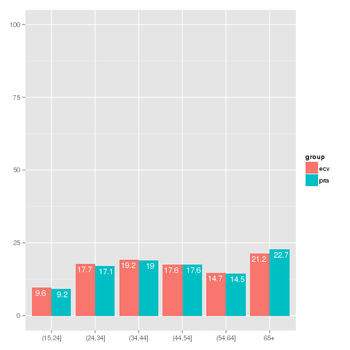
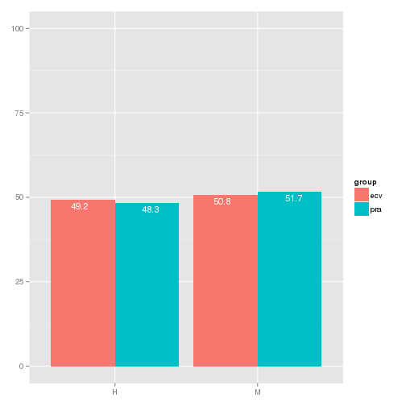
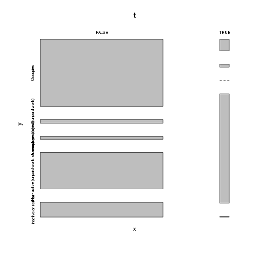
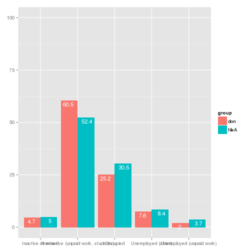
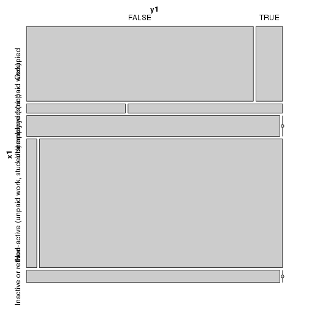
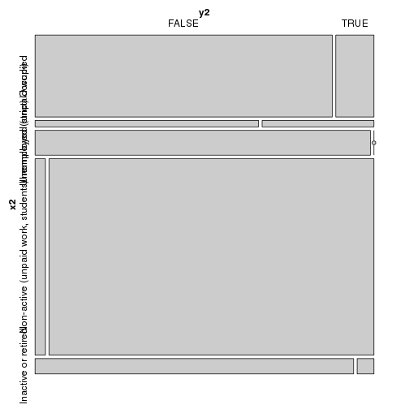

<!--
%\VignetteEngine{knitr::rmarkdown}
%\VignetteIndexEntry{Explaining micromatch package}
-->

Explaining `micromatch` package
================================
The `micromatch` package provides a set of utilities and functions to ease the task of statistical matching of official microdata files.

What is statistical matching?
-----------------------------
Statistical matching (also known as data fusion data merging or synthetic matching) is set of techniques for providing joint information on variables or indicators collected through multiple sources, usually, surveys drawn from the same population. The potential benefits of this approach lie in the possibility to enhance the complementary use and analytical potential of existing data sources. (A. Leulescu & M. Agafitei, 2013).

### The starting point

The statistical matching task usually begins with two independent survey samples from the same population of interest, each of which produces measures regarding specific questions (for example, living styles and wages), but sharing a block of common variables (usually sociodemographic variables such as the age, sex, or social status), see Fig.1. The basic assumption is that the number of individuals or units appearing in both samples (i.e., the overlap) is negligible. In this respect, the fundamental difference with respect to other methods such as record linkage is that, in the latter, we have identical units that we want to match exactly, while in statistical matching we _know_ the units are different, but we _wish_ to find similar ones. 


### When should we consider using `micromatch?
The user will be ready to use `micromatch` when having two separate files, A and B, with _distinct units_ referred to the _same population of interest_, having two sets of distinct variables in each file (which we call _specific variables_), and sharing a common block of variables (which we call _common variables_). The user wishes to do specific statistical analyses that combine variables coming from the distinct files or sources, and faces the problem of lacking observations with information for all the variables. 

By applying statistical matching methods, the user will typically obtain either a synthetic file containing information on all the variables and all units from both sources (so in this case statistical matching could be viewed as a kind of missing data imputation procedure). Sometimes, when only two variables in separate files are of specific interest, the user could more efficiently estimate a contingency table or correlation coefficient, or any parameter of interest regarding only those two variables of interest. The former is named the _micro_ approach, while the latter is the _macro_ approach.

Also, the distiction of _donor_ and _recipient_ files is useful if a micro method is applied (that is, a synthetic file is produced): sometimes, only one of the files (the one having more observations, the _recipient_) is filled with the variables from the other file (the _donor_). In this case, the synthetic file will have as much observations as the recipient file.

The statistical matching methods efficiently use the information provided by the block of common variables in order to produce a plausible or valid synthetic file.

### What is the particular solution implemented in `micromatch`?
The functions currently available in `micromatch` are organized in four families, which closely follow the main steps in the statistical matching process, see Fig 2.


### Functions by families in `micromatch`

#### Family 1: Specify matching objectives

First of all the matching objectives must be specified, which means that the user has to define:

* A list of common variables (i.e. variables which are, by definition, identical accross the files. Ex. age, sex, education level)
* A list of specific variables for the first file (usually called the )
* A list of specific variables for the second file
* Ideally, the desired result (a synthetic file or contingency table, for example)

        * Funciones implementadas: en este momento solamente disponemos de la clase `matchdesign` que encapsularía toda esta información así como del método `describe`, que la extraería de un objeto de esta clase.

#### Family 2: Select matching variables

In this step one most select a set of variables that will be used by the matching procedure, such that:

* They are concordant across the files; i.e. besides having the same definition (i.e. comparable questions in the questionnaires), they produce the same observed marginal distributions.
* They have predictive value with respect to the specific variables (in each file) 

        * Funciones implementadas:

        *compareVar*
        Compara la distribución marginal observada para una única variable categórica en los dos ficheros. Produce gráficos de barras y medidas empíricas como la distancia de Hellinger. Se pueden emplear pesos, y las tablas generadas. Futuros desarrollos: extenderlo a variables continuas.

        *compareMultivar*
        Extiende la anterior para poder analizar la concordancia de distribuciones al condicionar por alguna otra variable, generalmente, estratos (como la edad y sexo). La lógica es la misma. Futuros desarrollos: los mismos. Adicionalmente, se debería estudiar la posibilidad de emplear técnicas multivariantes para comparar espacios factoriales, por ejemplo, un análisis de correspondencias y el coeficiente RV. esto es muy fácil de hacer con FactoMineR. También aportaría una visualización del espacio de variables comunes, donde además podríamos proyectar las específicas.

        *predictvalue*
        Solamente válida para variables categóricas, mide el valor predictivo de una variable común cada vez para una variable específica dada. Produce valores dados por la función `pw.assoc` de `StatMatch`: la V de Cramer, etc, y se le añade un gráfico de mosaico dado por `structplot`. Con un `sapply` se puede analizar el valor predictivo de una lista de variables comunes en una sola iteración. Futuros desarrollos: esta aproximación univariante es demasido básica, sería deseable poder hacer modelos de regresión o bien implementar el random forest (fácil con `randomForest`), o algo similar, pero con fundamento estadística adecuado.
        
        *uncertvarxvary*
        Aún en modo de prueba, implementa la idea reflejada en StatMatch de seleccionar aquellas variables que más reduzcan la incertidumbre en cuanto a las distribuciones conjuntas no-observadas. También es un elemento esencial de la validación, con lo que también pertenecería a la Familia 4
        
#### Family 3: Apply matching method

At this step a matching method is applied to either a synthetic file or a macro parameter estimation.

        *Funciones implementadas:

        *nnhdbystrata*
        
        Básicamente es la nearest-neighbour hot-deck implementada en StatMatch, función `NND.hotdeck`, pero lo que aporta es que se efectúa un hot-deck para un estrato dado. Esto nos da la posibilidad de aplicar el matching por estratos de forma rápida usando un solo `sapply` que itere sobre todos los estratos. Futuros desarrollos: queda implementar una función similar que emplee funciones de `mice` (idealmente predictive mean matching que al parecer es muy robusto). Entonces seguramente será necesario crear una función intermedia que genere un fichero concatenado para pasar a `mice`.


#### Family 4: Validation

At this step a thorough validation of results must be performed.

        *Se pueden utilizar `compareVar` y `compareMultiVar` para comparar las distribuciones de variables observadas vs imputadas, una vez producido el fichero sintético. Sería muy interesante añadir funciones para poder hacer ejercicios de simulación (que servirían para probar si el matching es robusto, entender mejor sus tripas, etc). Hay referencias al respecto, y darían un valor añadido ya que en `StatMatch` no hay nada parecido.


### Ejemplo de uso

#### Cargar paquete y datos

Los datos de dos encuestas de Eustat, ECV y PRA, se han cargado en el propio paquete micromatch. 

        * Está pendiente documentarlas: parece que no funciona el script ecv-data.R

**Encuestas de Eustat**
Datos en el mismo micromatch:
1. PRA: Población en relación con la actividad
2. ECV: Encuesta de condiciones de vida

```
## [1] 4749  417
```

```
## [1] 10865    73
```

### Etapa 1: Definir objetivos

Primero definir lo que se quiere hacer:

* _Variables comunes candidatas_: en principio, se introducen todas las que podrian valer.
Luego hay que descartar las que no son concordantes (distribuciones muy distintas), y las que no tienen capacidad predictiva (no tienen relación con las variables específicas)
* _Variables especificas_
* Idealmente, _objetivo del enlace_: lo que se quiere obtener (tablas, fichero sintético, etc)

*Listas de variables*

```r
#variables comunes candidatas: las variables que comparten ecv y pra
#aun no sabemos si seran coherentes; lo son en cuanto a la definicion
#(preguntas de los cuestionarios), pero hay que ver si las distribuciones
#observadas coinciden.
#Esto hay que analizarlo no solo en general, sino en funcion de los valores 
#de otras variables, por ejemplo, por edad y sexo
#
varCom <- c("ED", #Edad: estrato
            "S",  #Sexo: estrato
            "TF2", #Tamanyo familiar
            "EST", #Estudiante si (1) o no (0)
            "OCP", #Ocupado si/no
            "PAR", #Parado si/no
            "INA", #Inactivo si/no
            "BUSQ", #Buscando empleo si/no
            "DOM.com2") #Dedicacion a las tareas domesticas
#
#variables especificas ECV
varEsp <- c("SAL",  #condiciones de salud
            "IDM",  #conocimiento idiomas
            #"DOM",  #(la ponemos como variable comun) dedicacion tareas domesticas
            "NIN", #cuidado de ninyos
            "VAC", #lugar de vacaciones
            "LIB", 
            "RELI", 
            "RELF", 
            "EQP",
            "VIV",
            "VEH",
            "SRV", 
            "AMB",
            "DOM2",
            "ECO",
            "ING",
            "FIN" )
#variable especifica de PRA
vary <- "PRA22"
```

### Etapa 2: Selección de variables

*Coherencia de fuentes*

**Función: compareVar**

Univariate comparisons: Compares one variable at a time

Only check first 2 variables.


```r
#consultar documentacion: ?compareVar
#dar valores a los parametros fijos
fileA <- ecv
fileB <- pra
wA <- wB <- "calELE" #variable de peso calibrada
#
# all comparisons for a list of common vars at once
#absolute values, no plotting, no empirical measures
sapply(X=1:2, FUN=function(x){
        print(paste('Variable: ',varCom[x]))
        varA <- varB <- varCom[x]
        c <- compareVar(varA=varA, varB=varB,fileA=fileA,fileB=fileB,wA=wA, wB=wB,plot=FALSE,measures=FALSE,type="abs")
        print(c)
})
```

```
## [1] "Variable:  ED"
## $`table for file #1`
## x1
## (15,24] (24,34] (34,44] (44,54] (54,64]     65+     Sum 
##  177684  327581  355344  325660  273009  393715 1852993 
## 
## $`table for file #2`
## x2
## (15,24] (24,34] (34,44] (44,54] (54,64]     65+     Sum 
##  171921  319528  355384  328303  270392  423928 1869456 
## 
## $measures
## NULL
## 
## [1] "Variable:  S"
## $`table for file #1`
## x1
##       H       M     Sum 
##  911419  941573 1852992 
## 
## $`table for file #2`
## x2
##       H       M     Sum 
##  903821  965634 1869455 
## 
## $measures
## NULL
```

```
##                   [,1]      [,2]     
## table for file #1 Numeric,7 Numeric,3
## table for file #2 Numeric,7 Numeric,3
## measures          NULL      NULL
```

```r
#relative values, plotting, with empirical measures (Hellinger's Distance, etc)
sapply(X=1:2, FUN=function(x){
        print(paste('Variable: ',varCom[x]))
        varA <- varB <- varCom[x]
        #relative values, with plot
        c<- compareVar(varA=varA, varB=varB,fileA=fileA,fileB=fileB,wA=wA, wB=wB,plot=TRUE,measures=TRUE,type="rel")
        print(c)
})
```

```
## [1] "Variable:  ED"
```

```
## ymax not defined: adjusting position using y instead
```

 

```
## $`table for file #1`
## x1
## (15,24] (24,34] (34,44] (44,54] (54,64]     65+     Sum 
##    9.59   17.68   19.18   17.57   14.73   21.25  100.00 
## 
## $`table for file #2`
## x2
## (15,24] (24,34] (34,44] (44,54] (54,64]     65+     Sum 
##    9.20   17.09   19.01   17.56   14.46   22.68  100.00 
## 
## $measures
##     tvd overlap   Bhatt    Hell 
## 0.01429 0.98571 0.99983 0.01302 
## 
## [1] "Variable:  S"
```

```
## ymax not defined: adjusting position using y instead
```

 

```
## $`table for file #1`
## x1
##      H      M    Sum 
##  49.19  50.81 100.00 
## 
## $`table for file #2`
## x2
##      H      M    Sum 
##  48.35  51.65 100.00 
## 
## $measures
##      tvd  overlap    Bhatt     Hell 
## 0.008396 0.991604 0.999965 0.005939
```

```
##                   [,1]      [,2]     
## table for file #1 Numeric,7 Numeric,3
## table for file #2 Numeric,7 Numeric,3
## measures          Numeric,4 Numeric,4
```

```r
#To analyze all variables in varCom list, use sapply(X=1:length(varCom), FUN=...)
```

*Coherence of variables by strata (facets) in separate sources*

**Función: compareMultivar**

Elegimos una variable de muestra: el indicador de Estudiante S/N.
Para estudiar todas a la vez se emplearía, como antes, un sapply.


```r
#consultar documentacion ?compareMultivar
var1A <- var1B <- varCom[2] #S estrato
var2A <- var2B <- varCom[4] #variable a estudiar (dependiente)
var3A <- var3B <- varCom[1] #ED  estrato
#absolute values, no measures, no plotting
compareMultivar(var1A=var1A,var1B=var1B,var2A=var2A,var2B=var2B,var3A=var3A,var3B=var3B,fileA=fileA, fileB=fileB, type="abs",measures=FALSE,wA=wA, wB=wB, plot=FALSE)
```

```
## $`table for file #1`
##          z1 (15,24] (24,34] (34,44] (44,54] (54,64]    65+
## x1 y1                                                     
## H  FALSE      40566  153508  179269  155768  133761 173095
##    TRUE       51073   13199    2340    7283     896    660
## M  FALSE      36277  149322  164325  158928  136252 218578
##    TRUE       49768   11552    9409    3680    2099   1382
## 
## $`table for file #2`
##          z2 (15,24] (24,34] (34,44] (44,54] (54,64]    65+
## x2 y2                                                     
## H  FALSE      33498  159737  181957  162409  130940 173849
##    TRUE       55454    5136     408     151     143    139
## M  FALSE      24872  144742  170772  164745  138275 249323
##    TRUE       58098    9914    2246     997    1033    617
## 
## $measures
## NULL
```

```r
#relative values, with measures, plotting
compareMultivar(var1A=var1A,var1B=var1B,var2A=var2A,var2B=var2B,var3A=var3A,var3B=var3B,fileA=fileA, fileB=fileB, type="rel",measures=TRUE,wA=wA, wB=wB, plot=TRUE)
```

  

```
## $`table for file #1`
##          z1 (15,24] (24,34] (34,44] (44,54] (54,64]   65+
## x1 y1                                                    
## H  FALSE       2.19    8.28    9.67    8.41    7.22  9.34
##    TRUE        2.76    0.71    0.13    0.39    0.05  0.04
## M  FALSE       1.96    8.06    8.87    8.58    7.35 11.80
##    TRUE        2.69    0.62    0.51    0.20    0.11  0.07
## 
## $`table for file #2`
##          z2 (15,24] (24,34] (34,44] (44,54] (54,64]   65+
## x2 y2                                                    
## H  FALSE       1.79    8.54    9.73    8.69    7.00  9.30
##    TRUE        2.97    0.27    0.02    0.01    0.01  0.01
## M  FALSE       1.33    7.74    9.13    8.81    7.40 13.34
##    TRUE        3.11    0.53    0.12    0.05    0.06  0.03
## 
## $measures
##     tvd overlap   Bhatt    Hell 
## 0.03319 0.96681 0.99588 0.06418
```

*Assess predictive value of concordant variables*

**Function: predictvalue**

For each common variable found to be concordant between the files, we assess its predictive value with respect to the chosen specific variables. One variable at a time.

Note that in each assessment, only one of the files is used, i.e. the one that contains the specific variable to predict.


```r
#choose values
varA <- "EST" #variable to assess, name in file B
data <- pra
varw <- "calELE"
#
#table with absolute values, no measures, no plotting
predictvalue(varx=varA, vary=vary, data=data,varw=varw,plot=FALSE,measures=FALSE,type="abs")
```

```
## $Table
##        y
## x       Occupied Unemployed (unpaid work) Unemployed (strict)
##   FALSE   934865                    48577               38391
##   TRUE     12506                     3285                   0
##   Sum     947371                    51862               38391
##        y
## x       Non-active (unpaid work, students) Inactive or retired     Sum
##   FALSE                             508594              204692 1735119
##   TRUE                              117930                 615  134336
##   Sum                               626524              205307 1869455
## 
## $Measures
## [1] "measured not requested"
```

```r
#table with relative values, measures, plotting
predictvalue(varx=varA, vary=vary, data=data,varw=varw,plot=TRUE,measures=TRUE,type="rel")
```

 

```
## $Table
##        y
## x       Occupied Unemployed (unpaid work) Unemployed (strict)
##   FALSE    53.88                     2.80                2.21
##   TRUE      9.31                     2.45                0.00
##   Sum      63.19                     5.25                2.21
##        y
## x       Non-active (unpaid work, students) Inactive or retired    Sum
##   FALSE                              29.31               11.80 100.00
##   TRUE                               87.79                0.46 100.01
##   Sum                               117.10               12.26 200.01
## 
## $Measures
## $Measures$V
##    y.x 
## 0.3219 
## 
## $Measures$lambda
##    y.x 
## 0.1143 
## 
## $Measures$tau
##     y.x 
## 0.05982 
## 
## $Measures$U
##     y.x 
## 0.04586
```

**Function: uncertvarxvary**

Otra opción interesante para la selección de variables es el cálculo de bandas de incertidumbre. La idea es seleccionar las variables comunes que más reduzcan la incertidumbre (anchura de las bandas) el relacionar las variables específicas de las encuestas.


```r
data1 <- ecv
data2 <- pra
basedata <- pra
varw1 <- "calELE"
varw2 <- "calELE"
varx <- varEsp[1]
vary <- "PRA22"
varlist <- varCom[1:7] #restricted list of common variables, just to check
varlist
```

```
## [1] "ED"  "S"   "TF2" "EST" "OCP" "PAR" "INA"
```

```r
uncertvarxvary(varx=varx,vary=vary,data1=data1,data2=data2,basedata=basedata,varw1=varw1,varw2=varw2,varlist=varlist)
```

```
## $Best
## [1] "|ED+S+TF2+EST+OCP+PAR"
## 
## $NumberVariables
## [1] 6
## 
## $NumberCells
## [1] 288
## 
## $OvUncert
## [1] 0.05638
```

**NOTE**
Note that warnings are generated because observed distributions are not concordant between the files when crossing so many variables. Uncertainty evaluation might make more sense in specific stratum and with less variables, controlling that a minimum level of coherence between the sources is satisfied.

### Etapa 3: Aplicar un método de enlace

**Function: nnhdbystrata**

Generalmente, el enlace se hará por estratos. En el caso de ECV-PRA hemos usado 12 grupos de edad y sexo, y dentro de cada uno se ha realizado un hot-deck independiente, usando variables distintas cada vez.

Mostramos un ejemplo.


```r
#check documentation ?nnhdbystrata
#select stratum
i <- 1 ##select here: values between 1-12
strata <- as.factor(levels(ecv$EDS))
strata.sel <- strata[i]
strata.sel #this is selected stratum
```

```
## [1] H.(15,24]
## 12 Levels: H.(15,24] H.(24,34] H.(34,44] H.(44,54] H.(54,64] ... M.65+
```

```r
#
#Select variables for this stratum 
# The decision must be grounded on the previous phase
matchvars <- c("EST", "BUSQ")
matchvars
```

```
## [1] "EST"  "BUSQ"
```

```r
#
#donante y receptor
don <- pra[which(pra$EDS  == strata.sel ), ]
rec <- ecv[which(ecv$EDS  == strata.sel ), ]
wA <- wB <- "calELE"
vary <- "PRA22"
#
fused.1 <- nnhdbystrata(rec=rec,don=don,stratalevel=strata.sel,stratavar="EDS",matchvars=matchvars,vary=vary, checkdiffs=TRUE)
```

```
##          fused$EST.don
## fused$EST FALSE TRUE
##     FALSE    69    0
##     TRUE      0   88
##           fused$BUSQ.don
## fused$BUSQ FALSE TRUE
##      FALSE   133    0
##      TRUE      2   22
```

```r
#
#check output (a data frame with fused file)
#str(fused.1)
#names(fused.1) ## ECV con la variable PRA22 adicional
dim(fused.1) #only for strata #1
```

```
## [1] 157 418
```

**NOTE #1**
Note that the by setting the logical parameter checkdiff to TRUE, a table is generated for each selected matching variable to check for differences between the values in that variable for the recipient-donor files. If all values are placed in the diagonal then all recipient-donor pairs will be equal in that variable.

**NOTE #2**
In this example, the fused file was only obtained for the first stratum. The usage is to perform hot-deck for all the strata, store results in 12 data frames and then appy rbind to get a fused file with all the rows of the original recipient file.

### Etapa 4: Validar resultados

The same functions used for variable selection (concordance assessment) can be used to compare distributions of observed/imputed variables. Thus, these function belong to two families in the package.

**Function: compareVar**


```r
#compare observed/imputed distributions
varA <- varB <- "PRA22"
wA <- wB <- "calELE"
fileA <- fused.1
fileB <- don
#
compareVar(varA=varA,varB=varB,fileA=fileA,fileB=don,wA=wA,wB=wB,plot=TRUE,type="rel",measures=TRUE)
```

```
## ymax not defined: adjusting position using y instead
```

 

```
## $`table for file #1`
## x1
##                           Occupied           Unemployed (unpaid work) 
##                              30.47                               3.72 
##                Unemployed (strict) Non-active (unpaid work, students) 
##                               8.42                              52.41 
##                Inactive or retired                                Sum 
##                               4.98                             100.00 
## 
## $`table for file #2`
## x2
##                           Occupied           Unemployed (unpaid work) 
##                              25.22                               1.98 
##                Unemployed (strict) Non-active (unpaid work, students) 
##                               7.63                              60.45 
##                Inactive or retired                                Sum 
##                               4.72                             100.00 
## 
## $measures
##     tvd overlap   Bhatt    Hell 
## 0.08042 0.91958 0.99585 0.06443
```

**Function: compareMultivar**

```r
#compare observed/imputed distributions by levels of a second variable
var1A <- var1B <- "PRA22"
var2A <- var2B <- "EST"
wA <- wB <- "calELE"
fileA <- fused.1
fileB <- don
compareMultivar(var1A=var1A,var1B=var1B,var2A=var2A,var2B=var2B,fileA=fileA,fileB=fileB,wA=wA,wB=wB,plot=TRUE,type="rel",measures=TRUE)
```

  

```
## $`table for file #1`
##                                    y1 FALSE  TRUE
## x1                                               
## Occupied                              27.28  3.19
## Unemployed (unpaid work)               1.45  2.27
## Unemployed (strict)                    8.42  0.00
## Non-active (unpaid work, students)     2.13 50.28
## Inactive or retired                    4.98  0.00
## 
## $`table for file #2`
##                                    y2 FALSE  TRUE
## x2                                               
## Occupied                              22.35  2.87
## Unemployed (unpaid work)               1.32  0.66
## Unemployed (strict)                    7.63  0.00
## Non-active (unpaid work, students)     1.87 58.58
## Inactive or retired                    4.48  0.24
## 
## $measures
##     tvd overlap   Bhatt    Hell 
## 0.08537 0.91463 0.99334 0.08163
```


## Extensions: What if we create a new, specific class for matching?

*Class: matchdesign*

Define a matchdesign class that encapsulates the type of matching that we want.
To this class, we will pass:

* recipient file A
* donor file B
* Common variables (both in A & B)
* Specific variables in A
* Specific variables in B


```r
rec <- ecv
don <- pra
matchvars <- varCom[-c(1,2)]#Eliminamos ED, S que son de estrato
donvars <- c("PRA22") #variable especifica de PRA, la unica que se considera: PRA22
recvars <- "SAL" #variable especifica de ECV, un ejemplo: SAL 'trastornos de salud'
stratavar <- "ED" #variable de estrato
d1 <- new("matchdesign",rec=rec, 
                don=don, 
                matchvars=matchvars, 
                donvars=donvars,
                recvars=recvars,
                stratavar=stratavar
)
class(d1) #comprobacion de que la clase es 'matchdesign'
```

```
## [1] "matchdesign"
## attr(,"package")
## [1] "micromatch"
```

Dos métodos sencillos

**Method: Describe**

**Method: Compare1**

_describe_ nos devuelve los parámetros especificados en matchdesign
_compare1_ realiza un cálculo rápido de distancias de Hellinger para cada variable común especificada en matchdesign, por separado (sin considerar estratos)


```r
describe(d1)
```

```
## $`Number of receptor rows:`
## [1] 4749
## 
## $`Number of donor rows:`
## [1] 10865
## 
## $`Common matching variables:`
## [1] "TF2"      "EST"      "OCP"      "PAR"      "INA"      "BUSQ"    
## [7] "DOM.com2"
## 
## $`Specific vars receptor file:`
## [1] "SAL"
## 
## $`Specific vars donor file:`
## [1] "PRA22"
## 
## $`Strata variable:`
## [1] "ED"
```

```r
compare1(x=d1)
```

```
##     varCom    tvd overlap  Bhatt   Hell
## 1      TF2 0.0739  0.9261 0.9943 0.0752
## 2      EST 0.0086  0.9914 0.9999 0.0122
## 3      OCP 0.0081  0.9919      1 0.0057
## 4      PAR  0.006   0.994 0.9999 0.0099
## 5      INA 0.0021  0.9979      1 0.0015
## 6     BUSQ 0.0121  0.9879 0.9997 0.0173
## 7 DOM.com2 0.0648  0.9352 0.9978 0.0466
```

### Probar con otros datos externos

**Datos del INE**

1. EPA: Encuesta de poblacion activa
Filtramos los mayores de 16 y datos de Euskadi, para poder comparar con PRA
2. EES: Encuesta de estructura salarial


```r
#cargar datos del INE
#microdatos ya descargados desde la web
library(MicroDatosEs)
setwd("~/Documents/micromatch-ejemplosUso/datosINE")
epa4T2009 <- epa2005( epa.file = "datos_t409" )
#
#Filtrar: 
## datos de Eusadi, mayores de 16
nrow(epa4T2009[which(epa4T2009$ccaa==16 & epa4T2009$nivel==1 ),]) #con 16 anyos o mas
epa <- epa4T2009[which(epa4T2009$ccaa==16 & epa4T2009$nivel==1 ),]
#
setwd("~/Documents/micromatch")
```


## References
* A. Leulescu & M. Agafitei, *Statistical matching: a model based approach for data integration*, Eurostat methodolgies and working papers, 2013.
* *Data Integration* ESSnet project (http://www.cros-portal.eu/content/data-integration-finished)
* *ISAD* ESSnet project (http://www.cros-portal.eu/content/isad-finished)
* *Statistical Matching, Theory and Practice*, Marcello D'Orazio, Marco Di Zio, Mauro Scanu, Wiley, 2006.
* *Statistical Matching: A Frequentist Theory, Practical Applications and Alternative Bayesian Approaches (Lecture Notes in Statistics)*, S. Rässler, Springer, 2002.
